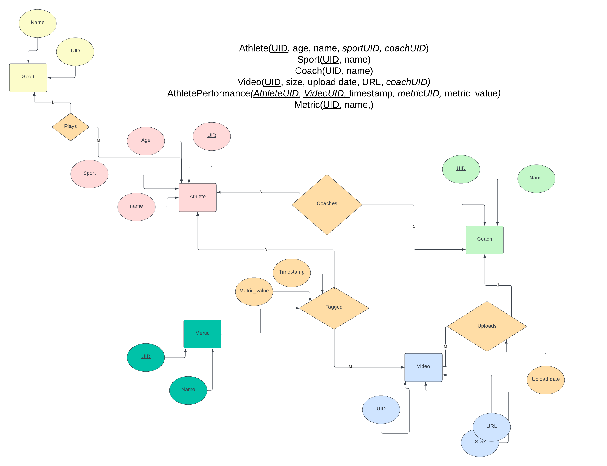

## 🛠 Tech Stack

- Frontend: React + Tailwind CSS: For it's scalability and ease of use
- Backend: Node.js + Express: lightweight and flexible for building APIs
- ORM: Prisma: Protects against sql injection attacks + easier to use and maintain
- Database: PostgreSQL: Reliable and powerful relational database
- Dev Tools: Docker: Containerize the application in order to make sure it can run on any machine


## 🚀 How to Run

```bash
#simply run (make sure docker is installed):
git clone github.com/Seif2001/ath-performance.git
cd ath-performance
docker compose up
# To seed sport and metric data into the database run
docker exec -it backend npm run seed
```
```bash

📁 Backend File Structure

├── backend.dockerfile
├── generated
│   └── prisma
├── index.js
├── package.json
├── package-lock.json
├── prisma
│   └── schema.prisma
├── src
│   ├── controllers
│   │   ├── athleteController.js
│   │   ├── coachController.js
│   │   ├── metricController.js
│   │   ├── sportController.js
│   │   └── videoController.js
│   ├── prisma
│   │   └── client.js
│   ├── routes
│   │   ├── athleteRoutes.js
│   │   ├── coachRoutes.js
│   │   ├── metricRoutes.js
│   │   ├── sportRoutes.js
│   │   └── videoRoutes.js
│   ├── services
│   │   ├── athleteService.js
│   │   ├── coachService.js
│   │   ├── metricService.js
│   │   ├── sportService.js
│   │   └── videoService.js
│   ├── uploads
│   └── utils
│       └── logger.js
└── structure.txt

13 directories, 37 files
```

``` bash
📁 Frontend File Structure
.
├── client.dockerfile
├── package.json
├── package-lock.json
├── src
│   ├── api
│   │   ├── athletes.js
│   │   ├── auth.js
│   │   ├── axiosInstance.js
│   │   ├── metrics.js
│   │   ├── sports.js
│   │   └── video.js
│   ├── App.css
│   ├── App.js
│   ├── components
│   │   └── Navbar.jsx
│   ├── context
│   │   └── CoachContext.jsx
│   ├── index.css
│   ├── index.js
│   ├── pages
│   │   ├── Hero.jsx
│   │   ├── login.jsx
│   │   ├── Players.jsx
│   │   ├── UploadVideo.jsx
│   │   ├── Videos.jsx
│   │   └── VideoViewer.jsx
│   ├── reportWebVitals.js
│   └── setupTests.js
└── tailwind.config.js

7 directories, 32 files
```

## 📊 Database ERD

Below is the Entity Relationship Diagram (ERD) showing the main tables and relations in the database:


